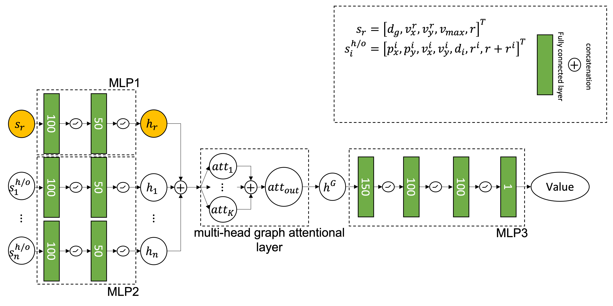
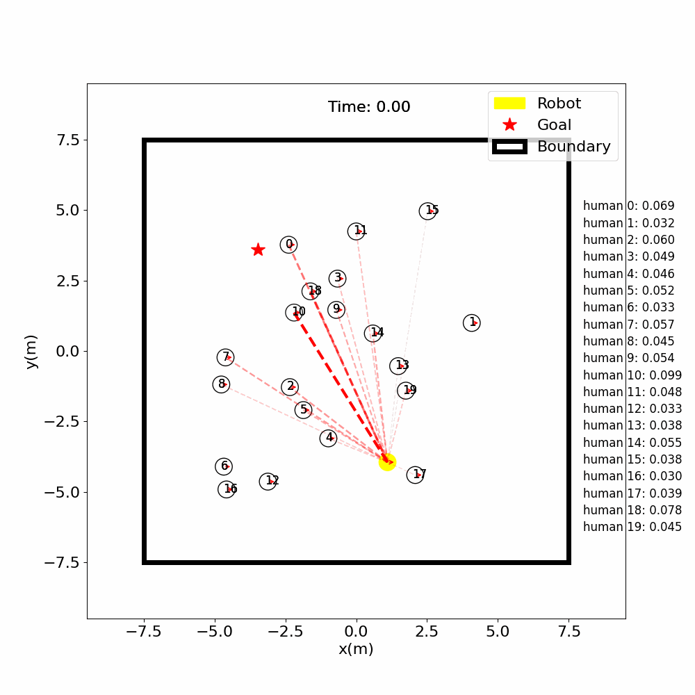
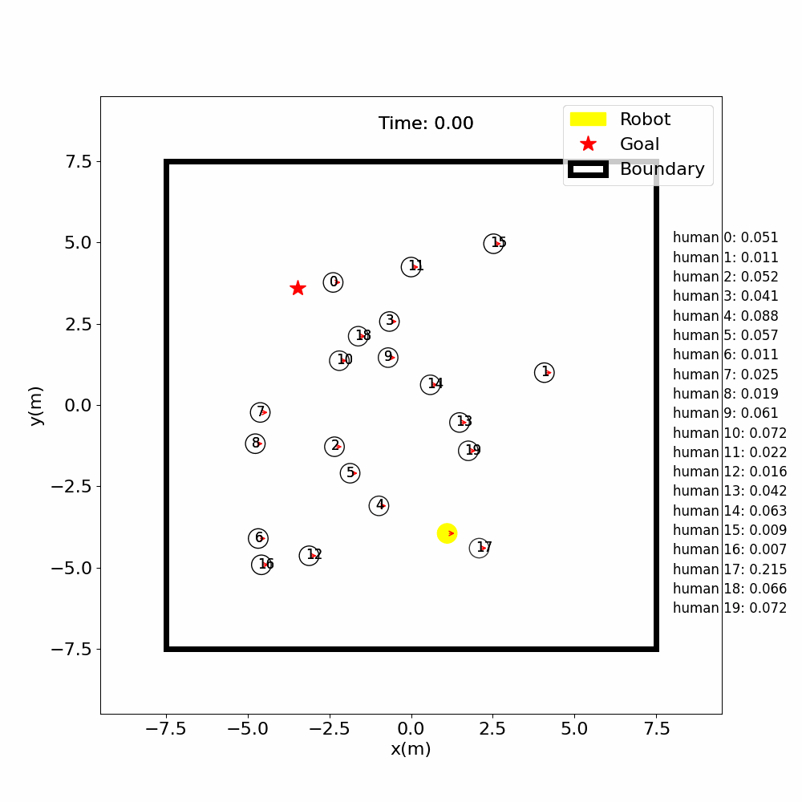
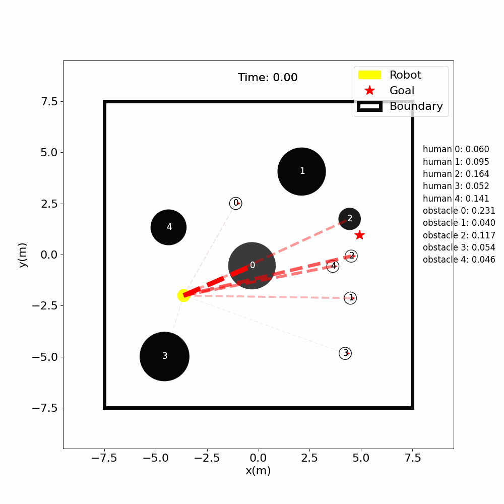
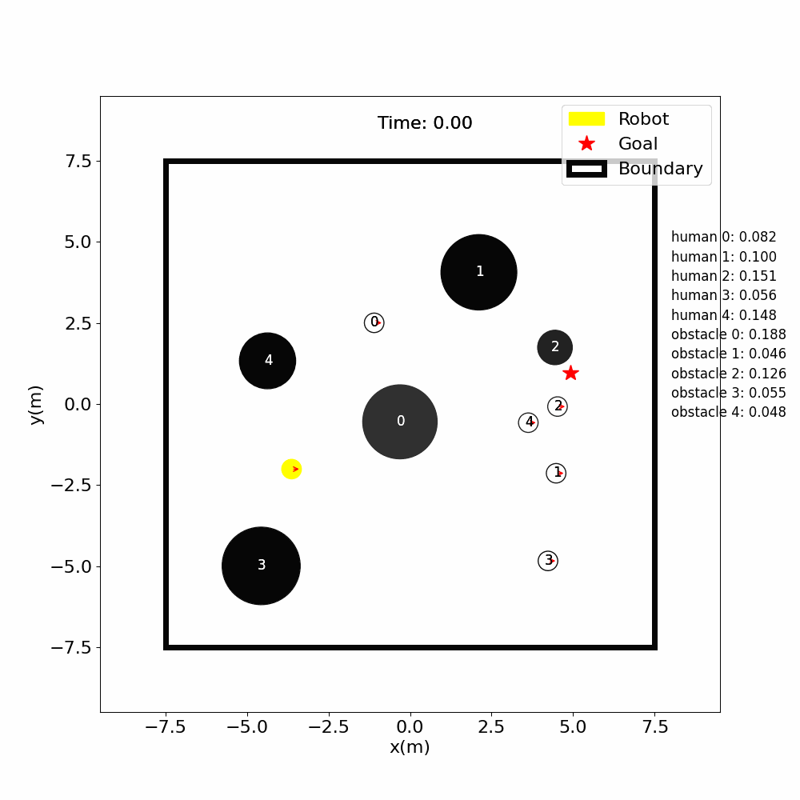
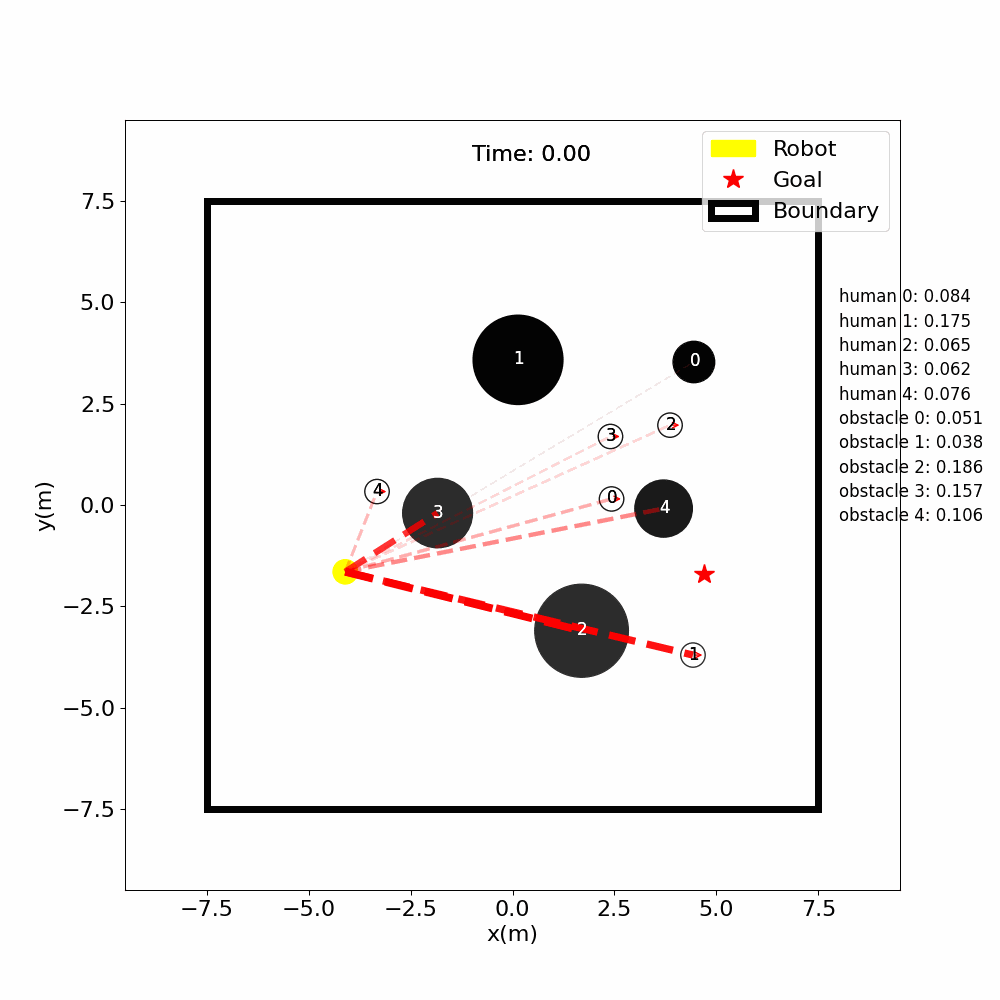
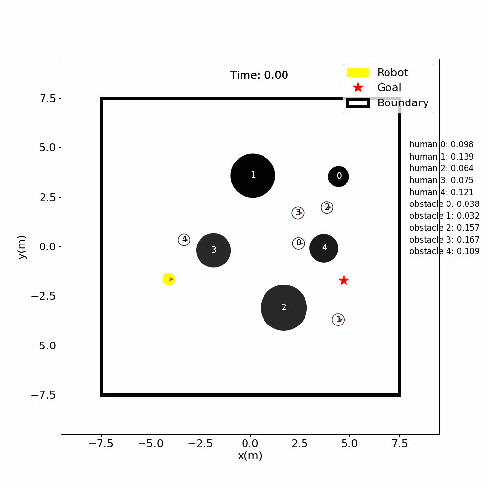
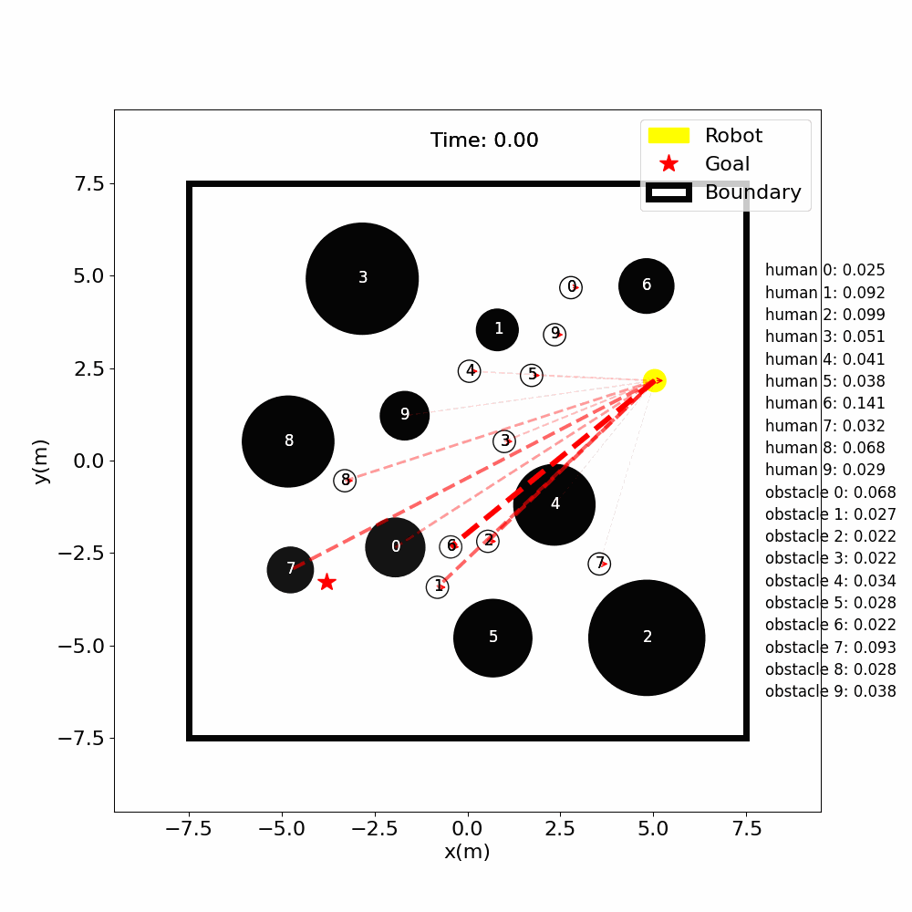
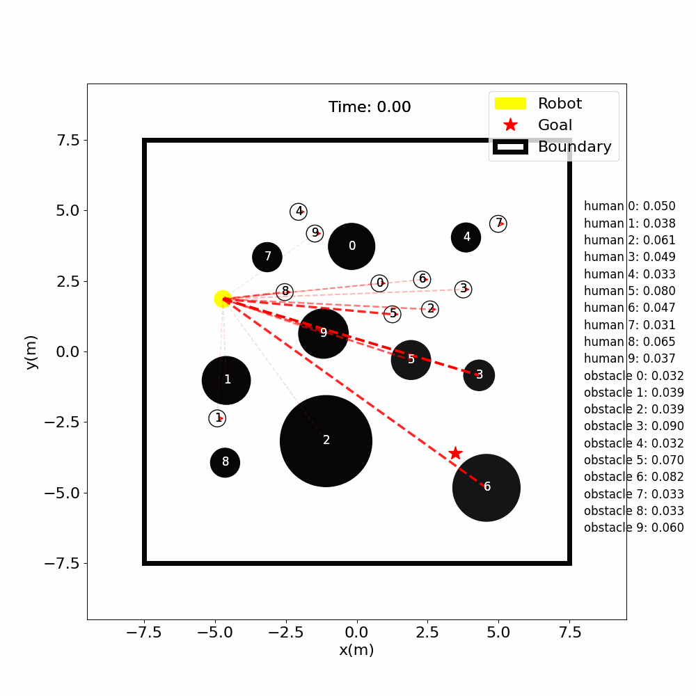

# CrowdNav
## Abstract
We envision a future with safe, interactive robots which can co-exist with people. For this reason we chose the topic "Social Navigation". Social navigation is the type of navigation, during which the agent aims to avoid conflicts with pedestrians in the environment while navigating towards its goal. SARL, the state of the art method proposed by Chen et. al. [[1]](https://arxiv.org/pdf/1809.08835.pdf), explores this problem in a simple environment without any obstacles. In our work, we investigate this problem further under more challenging conditions, explore the challenges, and share our insights in overcoming them.


## Graph Attention Network for Social Navigation (GAT4SN)


## Setup
1. Install [Python-RVO2](https://github.com/sybrenstuvel/Python-RVO2) library
2. Install crowd_sim and crowd_nav into pip
```
pip install -e .
```

## Getting Started
This repository is organized in two parts: gym_crowd/ folder contains the simulation environment and
crowd_nav/ folder contains codes for training and testing the policies. Details of the simulation framework can be found
[here](crowd_sim/README.md). Below are the instructions for training and testing policies, and they should be executed
inside the crowd_nav/ folder.


1. Train a policy.
```
python train.py --policy gat4sn
```
2. Test policies with 500 test cases.
```
python test.py --policy gat4sn --model_dir data/output --phase test
```
3. Run policy for one episode and visualize the result.
```
python test.py --policy gat4sn --model_dir data/output --phase test --visualize --test_case 0
```
4. Plot training curve.
```
python utils/plot.py data/output/output.log
```


## Simulation Videos
GAT4SN             | SARL
:-------------------------:|:-------------------------:
|
|
|

## More Complicated Environment?
Only Humans             | With Static Obstacles
:-------------------------:|:-------------------------:
|
|
