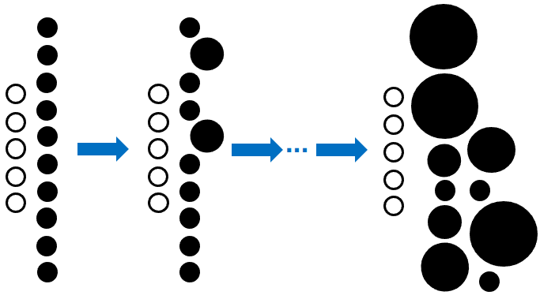
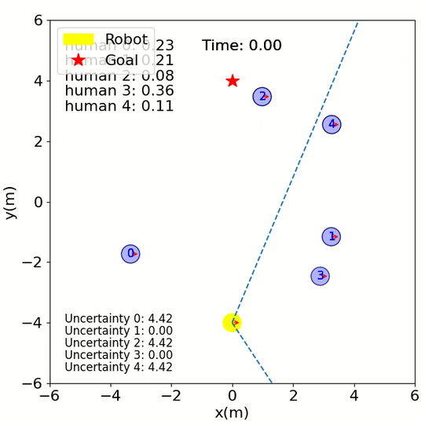
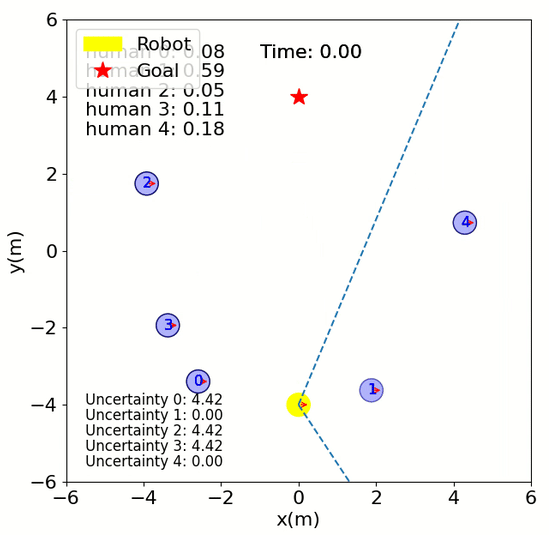
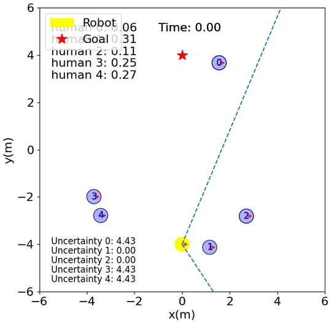
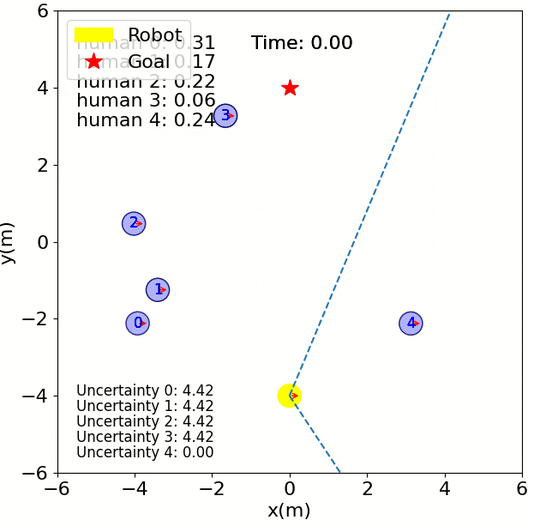

# ADLR SS22 Project: Social Navigation with Reinforcement Learning
## Abstract
We envision a future with safe, interactive robots which can co-exist with people. For this reason we chose the topic "Social Navigation". Social navigation is the type of navigation, during which the agent aims to avoid conflicts with pedestrians in the environment while navigating towards its goal. SARL, the state of the art method proposed by Chen et. al. [[1]](https://arxiv.org/pdf/1809.08835.pdf), explores this problem in a simple environment without any obstacles. In our work, we investigate this problem further under more challenging conditions, explore the challenges, and share our insights in overcoming them.

## Setup
1. Install [Python-RVO2](https://github.com/sybrenstuvel/Python-RVO2) library
2. Install crowd_sim and crowd_nav into pip
```
pip install -e .
```

## Getting Started
This repository is organized in two parts: crowd_sim/ folder contains the simulation environment and
crowd_nav/ folder contains codes for training and testing the policies. Details of the simulation framework can be found
[here](crowd_sim/README.md). Below are the instructions for training and testing policies, and they should be executed
inside the crowd_nav/ folder.


1. Train a policy.
```
python train.py --policy gat4sn
```
2. Test policies with 500 test cases.
```
python test.py --policy gat4sn --model_dir data/output --phase test
```
3. Run a policy for one episode and visualize the result.
```
python test.py --policy gat4sn --model_dir data/output --phase test --visualize --test_case 0
```
4. Plot training curves.
```
python utils/plot.py data/output/output.log
```

## Graph Attention Network for Social Navigation (GAT4SN)


### Simulation Videos
|                        GAT4SN                         |                        SARL                         |
|:-----------------------------------------------------:|:---------------------------------------------------:|
|  |  |
|          |          |
|          |          |

### More Complicated Environment?
|                      Only Humans                      |         With Static Obstacles          |
|:-----------------------------------------------------:|:--------------------------------------:|
|                  |  |
|  |  |

## Curriculum Learning

By making the training scenarios gradually harder, curriculum learning allows the robot to navigate in harder environments.
We increase the difficulty by allowing larger obstacles in the environment.


In order to train the agent with curriculum learning, use `cl_train.py` instead of `train.py`.

In order to test or visualize the results of curriculum learning training, use `cl_test.py` instead of `test.py`.

The curriculum learning hyperparameters can be configured in `[curriculum]` block of `train.config`.

## Limited Field of View
To increase the complexity of the task, the field of view of the robot can be limited. To activate limited field of view, set robot's sensor to `RGB` in `env.config`.
The limited FOV implementation is based on the implementation in [DSRNN](https://github.com/Shuijing725/CrowdNav_DSRNN).
We added some heuristics for the unseen agents. In order to toggle them, change `unseen_mode` in the `[humans]` block of `env.config`.

|          `unseen_mode`          |                              Description                               |                             Visualization                             |
|:-----------------------------:|:----------------------------------------------------------------------:|:---------------------------------------------------------------------:|
|        `ground_truth`         |        Same as LiDAR, provide gt pos. and vel. of pedestrians.         |                                                                       |
|         `stationary`          |       Always provide the last seen pos. and vel. of pedestrians.       |                                                                       |
|         `continuing`          |   Assume that the pedestrians keep moving in the last seen direction   |                   |
|        `slowing_down`         |   Same as above, but the assumed velocity decreases every time step.   |                 |
| `expanding_stationary_bubble` |     Increase the radius of unseen pedestrians at every time step.      |  |
|   `expanding_moving_bubble`   | Same as above, additionaly assume movement in the last seen direction. |      |

Additionally, the rate at which the unseen agents slow down or the increase in their radii is based on the parameter `uncertainty`. Its growth rate can be changed by changing `uncertainty_growth` under `[sim]` block of `env.config`. The options are: 
* `linear`
* `exponential`
* `logarithmic`

# License
This repository is based on our fork from [CrowdNav](https://github.com/vita-epfl/CrowdNav). Please check their repository for more detail on license conditions.
